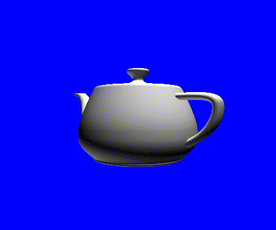

# threepeat

minimal lib for setting up animated loop scenes in [three.js](https://github.com/jbaicoianu/threecap) & recording them as `.mp4`, `.gif`, and more with [threecap](https://github.com/jbaicoianu/threecap)

`example.html` is one such scene:

    threepeat((scene, camera, renderer) => {

       //add mouse camera controls using OrbitControls
       var orbit = new OrbitControls( camera, renderer.domElement );

       //add simple lighting
       var ambientLight = new THREE.AmbientLight( 0x000000 );
       scene.add( ambientLight );
       var lights = [];
       lights[ 0 ] = new THREE.PointLight( 0xffffff, 0.65, 0 );
       lights[ 1 ] = new THREE.PointLight( 0xffffff, 0.65, 0 );
       lights[ 2 ] = new THREE.PointLight( 0xffffff, 0.65, 0 );
       lights[ 0 ].position.set( 0, 400, 0 );
       lights[ 1 ].position.set( 200, 400, 400 );
       lights[ 2 ].position.set( - 200, - 400, - 200 );
       scene.add( lights[ 0 ] );
       scene.add( lights[ 1 ] );
       scene.add( lights[ 2 ] );

       //add a teapot mesh
       var geometry = new TeapotBufferGeometry();
       var material = new THREE.MeshStandardMaterial( { color: 0xffffff } );
       var cube = new THREE.Mesh( geometry, material );
       scene.add( cube );
       camera.position.z = 300;

       // the function returned by our callback is executed on every frame, with t = loop progress in the interval [0, 1)
       return (t) => {
           cube.rotation.y = (2 * Math.PI) * t;
       }
     });
     
(in most cases its best to use a local server to run your script, see [threejs docs](https://threejs.org/docs/index.html#manual/en/introduction/How-to-run-things-locally) for more info)
     
in the browser console, or elsewhere in your script, use `record(<format>, <framerate>, <size>)` to render a loop of the sscene to your downloads folder
